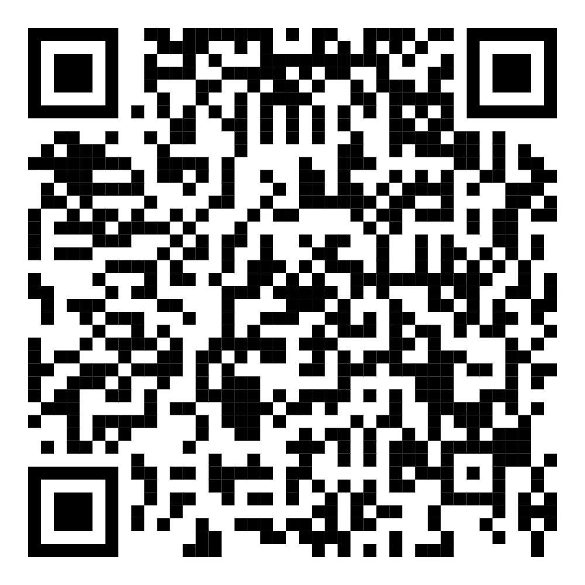

# Scouting

Get to the Scouting App

# Scanner Instructions

Prior to capturing data for a competition, we must prepare the scanner(s) for
data collection. We will follow the steps below to do so:

## 1. Factory Reset

Clear any and all previous settings.

## 2. Set the Ending Character

The scanner has the ability to change the terminator of any data scanned. We
want it to be set to the Enter key.

## 3. Set Mode to Storage

The scanner has the ability to connect to a computer and immediately send
results... we would like to store the results in the scanner's memory and send
them later. This will allow us to scan many codes and deliver them to a computer
later.

## 4. Send ALL Stored Data

At reasonable intervals, we want to retrieve the data from the scanner and store
in Excel (or whatever we decide should receive the data). Connect the scanner to
a computer, open the application to receive the data, position the cursor and
scan the code below.

## 5. Clear Data

This will clear any previously captured data. WARNING: This will delete
previously captured data. All data will be lost so use care when scanning this
code.

